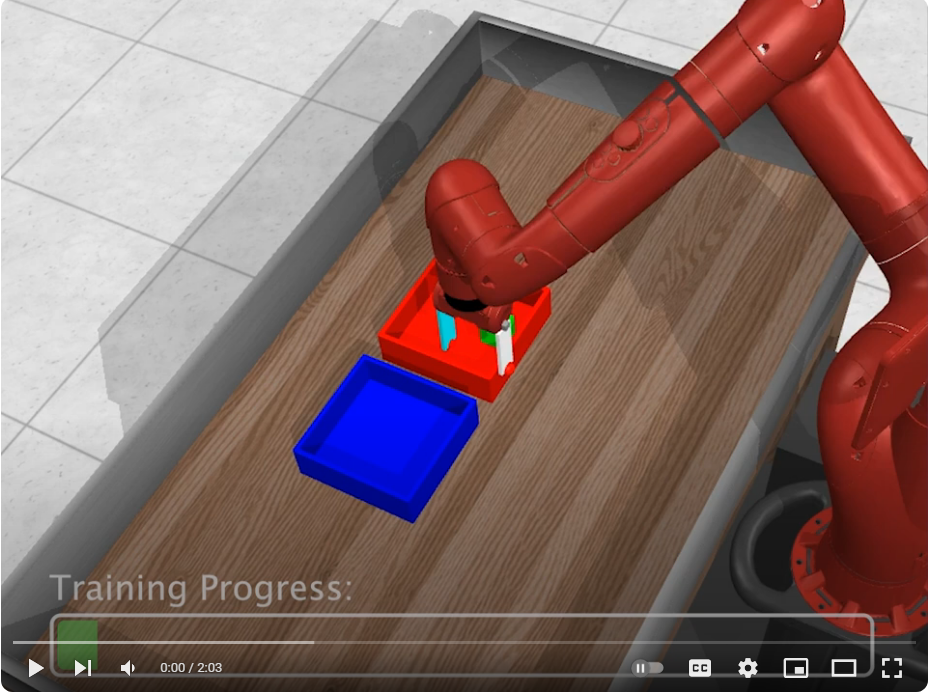

# A Single Goal is All You Need: Skills and Exploration Emerge from Contrastive RL without Rewards, Demonstrations, or Subgoals
## Abstract
In this paper, we present empirical evidence of skills and directed exploration emerging from a simple RL algorithm long before any successful trials are observed. For example, in a manipulation task, the agent is given a single observation of the goal state (see Fig.~\ref{fig:bin-visualization}) and learns skills, first for moving its end-effector, then for pushing the block, and finally for picking up and placing the block. These skills emerge before the agent has ever successfully placed the block at the goal location and without the aid of any reward functions, demonstrations, or manually-specified distance metrics. Once the agent has learned to reach the goal state reliably, exploration is reduced. Implementing our method involves a simple modification of prior work and does not require density estimates, ensembles, or any additional hyperparameters. Intuitively, the proposed method seems like it should be terrible at exploration, and we lack a clear theoretical understanding of why it works so effectively, though our experiments provide some hints.

<a href="https://github.com/graliuce/sgcrl/tree/main">Code</a> &nbsp;&nbsp;&nbsp;&nbsp;&nbsp;&nbsp; <a href="https://github.com/graliuce/sgcrl/tree/main">Paper</a>

